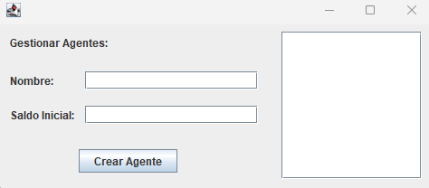
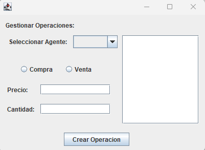

<h1 align="center">Broker de Bolsa</h1>
<h3 align="center">Iván Duro Fernández</h3>
## Descripción breve del proyecto
Este proyecto simula un sistema de operaciones de compra y venta de acciones mediante **agentes** y **broker**.
La app está desarrollada en el IDE Netbeans utilizando Swing para la interfaz de la aplicación y usa hilos para gestionar las
operaciones dichas anteriormente

---

### Funcionalidades
- **Agentes:**
Permite crear agentes con un nombre y un salario inicial. Estos agentes realizarán mas adelante las operaciones de compra y venta

  

- **Operaciones:**
Los agentes pueden crear la operaciones tipo, con la cantidad y el límite de precio.
Las operaciones se realizan de forma "automática" cuando el broker cumple las condiciones

  

- **Interfaz:**
La app incluye las siguientes ventanas:
1. Crear Agente
2. Crear Operación
3. Ver Gráfica
4. Salir (con la opción de teclado Control+Q)

- **Arquitectura:**
1. Modelo -> Contiene la clase Agente, Broker, ListaAgentes, Main, Operacion, PrecioDeLaAccion
2. View -> VistaAgente, VistaPrincipal, VistaDeLaGrafica y VistaAgente
3. Controlador -> ControladorAgente, ControladorFrontal, ControladorDeLaGrafica, ControladorDeLaOperacion y Persistencia
>En la propia aplicación, muchos de estos nombres están en inglés y otros en español
---

### ERRORES:
Intenté implementar, como se ve en el código, la persistencia de datos de agentes mediante la clase **Persistence** usando Gson,
para guardar y cargar agentes desde archivos con la extensión **JSON**.
Dicha persistencia no fue terminada ya que me dió muchos problemas a la hora de la ejecución del programa, el código está en la
propia app o comentado para ver que se "intento implementar" pero este punto estária incompleto

---

### Requisistos
- Java 17 o superior
- Maven
- IDE Netbeans
